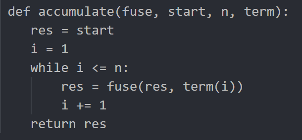
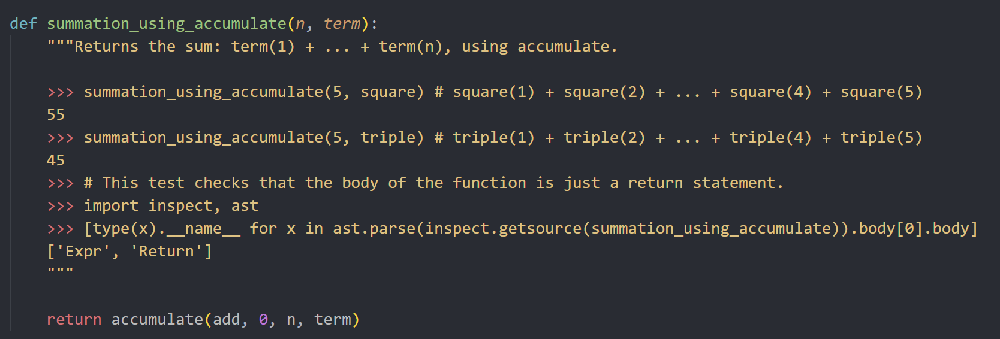

###在做homework2的时候发现了一些有趣的东西

###源代码是这样的

这个函数下面的功能是这样的

总言之就是返回一个值，return的语句只能有一行，从结果来看直接return前面写过的函数，这并不难，但是我想为什么不能用lambda函数，lambda函数内是以前写过的那个函数呢？这个思路的结果是错的，原因就在于lambda本身返回的是一个函数，并不是一个值，只有被调用的时候传进来的才是一个值。lambda x: func   前面的x是传进来的参数，并不是值